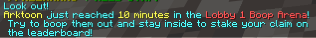
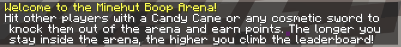
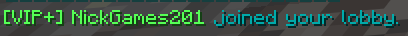
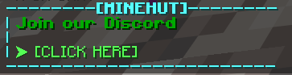

# MinehutEssentials

A Client-Side fabric mod for making Minehut bearable.
## Features

| Feature                  | What it blocks                                                 | Screenshot                                                                              |
|--------------------------|----------------------------------------------------------------|-----------------------------------------------------------------------------------------|
| Ad block                 | Messages containing `[AD]`                                     |                                                      |
| Boop time                | "just reached X minutes in the Lobby X Boop Arena" announcements |                                                       |
| Boop Arena welcome       | The Boop Arena welcome message                                 |                                             |
| Lobby join notice        | "USERNAME joined your lobby." messages                         |                                        |
| Minehut banner messages  | Banner-style messages with `--------[MINEHUT]--------`         |                                         |
| Raid countdown bossbar   | Raid starts in X Seconds bossbar                               |  |
| Raid ready               | "A new raid is ready! Enter the circle to begin."              |                                                      |
| Rules reminder           | Rules reminder messages (includes `/rules`)                    |                                              |
| Vote reward announcement | Vote reward announcements (`...by voting via /vote`)           |                                        |

## Todo / Fixes
- [ ] Add intermediate skipping by automatically using the barrier item to get to the lobby or desired server

## Usage

- `/mhessentials config` - Open the in-chat blocklist panel.
- Click `[Enable]` / `[Disable]` in the panel to toggle each filter.
- Mod Menu integration to easily toggle each filter 
- Each block is enabled by default

## Issues \& Pull Requests

\- Found a bug or problem? Open an issue: <https://github.com/NavaShield/MinehutEssentials/issues>  
\- Want to contribute a fix or improvement? Open a pull request: <https://github.com/NavaShield/MinehutEssentials/pulls>

## Compiling

1. Clone the repository:
   `git clone https://github.com/NavaShield/MinehutEssentials.git`
2. Enter the project folder:
   `cd MinehutEssentials`
3. Build with Gradle:
   `./gradlew build`
4. Find the compiled `.jar` in:
   `build/libs/`